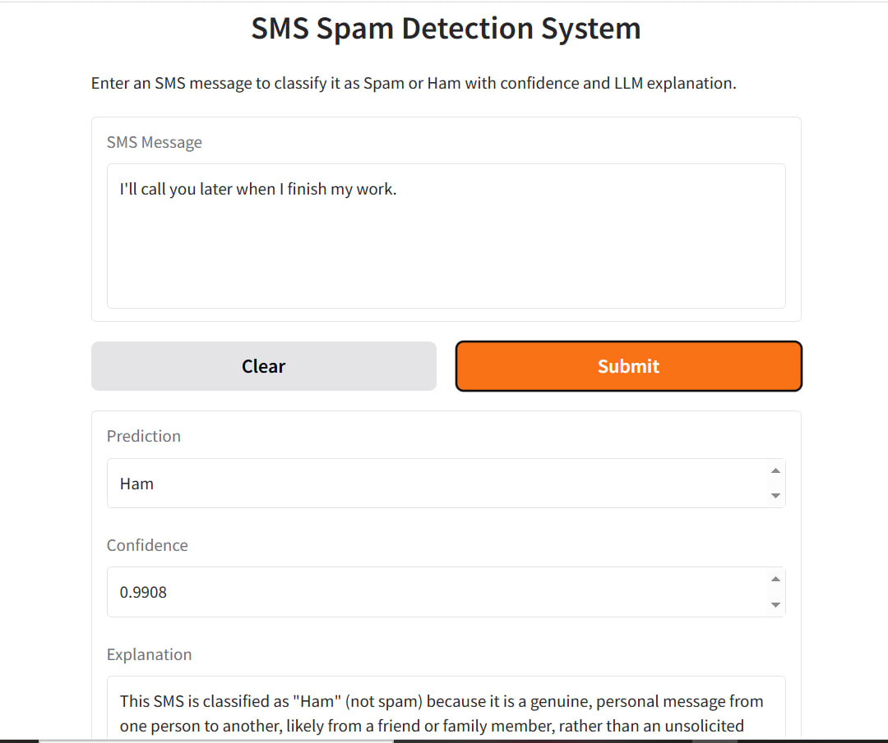

# SMS Spam Detection System

## Overview
This project builds a spam detection system using NLP and Machine Learning.

## Features
- TF-IDF and BERT embeddings
- Multiple ML models (SVM, Random Forest, etc.)
- Class imbalance handling
- Threshold tuning
- LLM-based explanation
- Gradio user interface

## Models
Final model:
BERT Embeddings + Balanced SVM

## Usage
Run the app:

python src/app.py

## Demo

### Gradio Interface

